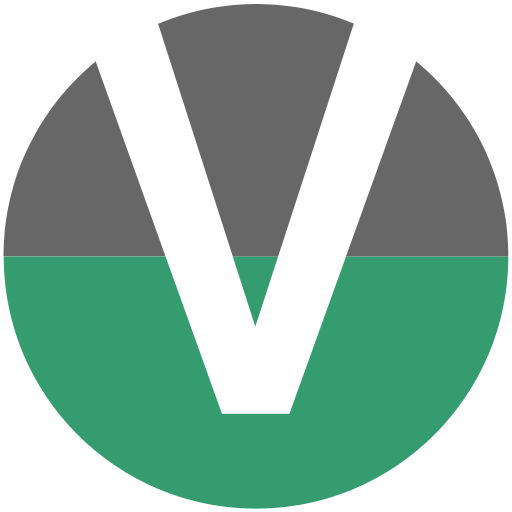

<h1 align="center">@yeger/vue-masonry-wall</h1>

<p align="center">
  
</p>

<p align="center">
    Responsive masonry layout with SSR support and zero dependencies for Vue 3.
</p>

<p align="center">
  <a href="https://github.com/DerYeger/vue-masonry-wall/actions/workflows/ci.yml">
    
  </a>
  <a href="https://www.npmjs.com/package/@yeger/vue-masonry-wall">
    
  </a>
  <a href="https://codecov.io/gh/DerYeger/vue-masonry-wall">
    
  </a>
  <a href="https://lgtm.com/projects/g/DerYeger/vue-masonry-wall">
    
  </a>
   <a href="https://www.npmjs.com/package/vue">
    
  </a>
  <a href="https://opensource.org/licenses/MIT">
    
  </a>
  <a href="https://bundlephobia.com/package/@yeger/vue-masonry-wall">
    
  </a>
</p>

## Features

- 📱 **Responsive**: Responsive with configurable column width and gaps. Based on `ResizeObserver`.
- 🔁 **Reactive**: Reacts to property changes.
- 🪶 **Lightweight**: Zero dependencies. Less than 1 kB.
- ⬅️ **RTL**: Supports LTR and RTL layouts.

## Links

- [Demo](https://vue-masonry-wall.yeger.eu/)
- [Vue 2 version](https://github.com/DerYeger/vue2-masonry-wall)
- [vue-masonry-wall by Fuxing Loh](https://github.com/fuxingloh/vue-masonry-wall)

## Installation

```bash
# yarn
$ yarn add @yeger/vue-masonry-wall

# npm
$ npm install @yeger/vue-masonry-wall
```

## Usage

```typescript
import { createApp } from 'vue'
import MasonryWall from '@yeger/vue-masonry-wall'

const app = createApp()

app.use(MasonryWall)
```

Props:
- `items`: Array of items. Required.
- `column-width`: Minimal width of columns in `px`.
- `gap`: Spacing between items in `px`. Defaults to `0`.
- `rtl`: Toggles between LTR (`false`) and RTL (`true`) layouts. Defaults to `false`.
- `ssr-columns`: Number of server-side-rendered columns. Optional.
- 
```vue
<template>
  <masonry-wall :items="items" :ssr-columns="1" :column-width="300" :gap="16">
    <template #default="{ item, index }">
      <div style="height: 100px">
        <h1>{{ item.title }}</h1>
        <span>{{ item.description }}</span>
      </div>
    </template>
  </masonry-wall>
</template>

<script>
export default {
  data() {
    return {
      items: [
        { title: 'First', description: 'The first item.' },
        { title: 'Second', description: 'The second item.'},
      ]
    }
  }
}
</script>
```

## Development

```bash
# install dependencies
$ yarn install

# build for production
$ yarn build

# lint project files
$ yarn lint

# serve demo
$ yarn demo:serve

# build demo for production
$ yarn demo:build
```

## Disclaimer

This component originated as a modified version of [vue-masonry-wall](https://github.com/fuxingloh/vue-masonry-wall) by [Fuxing Loh](https://github.com/fuxingloh).

## License

[MIT](./LICENSE) - Copyright &copy; Fuxing Loh, Jan Müller
